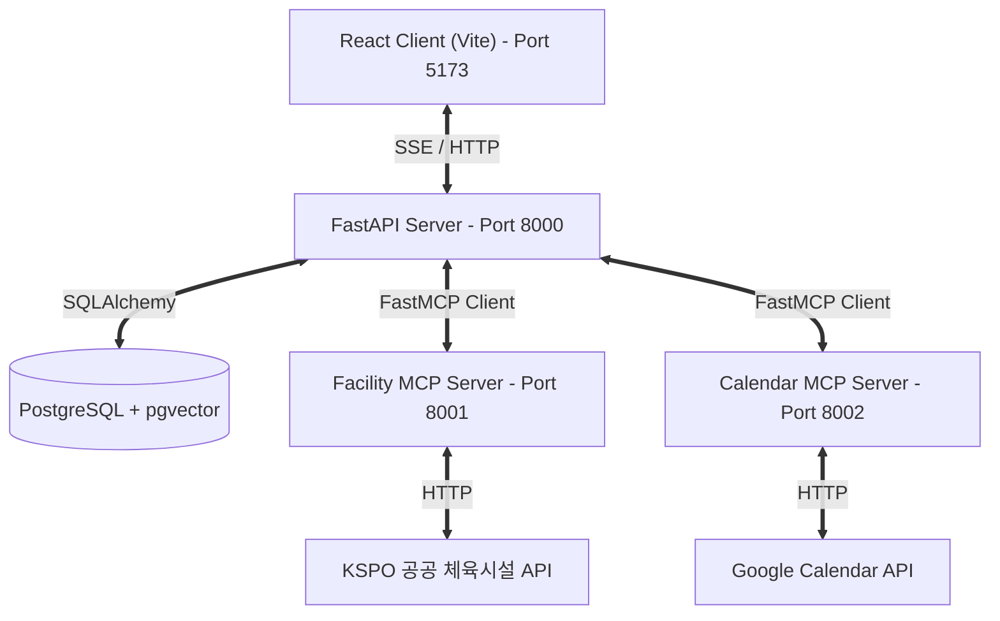
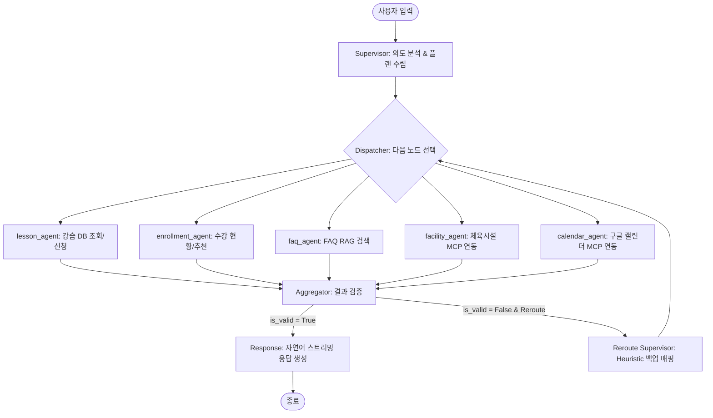
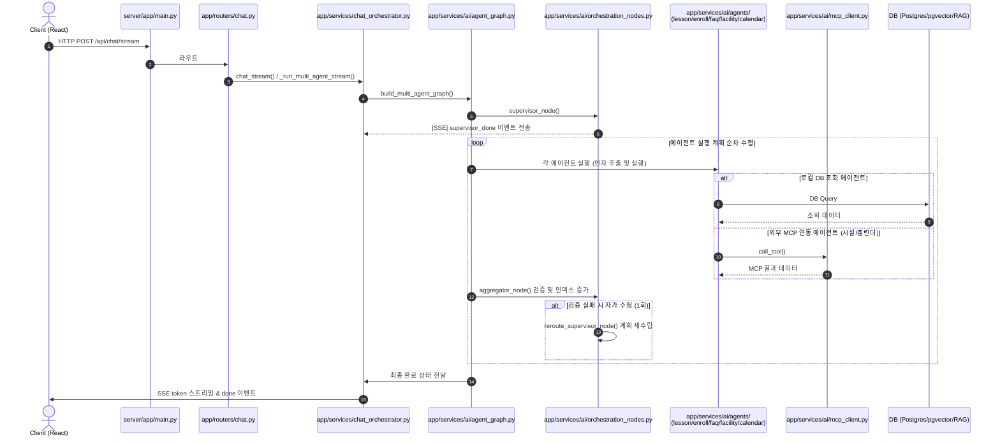
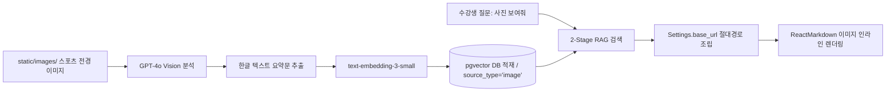

# Architecture

## 시스템 구성



| 서비스 | 노출 | Internal DNS |
|---|---|---|
| `course-agent` | public | - |
| `pgvector` | internal | `pgvector.railway.internal:5432` |
| `facility-mcp` | internal | `facility-mcp.railway.internal:8001` |
| `calendar-mcp` | internal | `calendar-mcp.railway.internal:8002` |

서비스 간 통신은 Railway internal DNS를 활용하여 안전하게 내부 망으로 연결됩니다.


## 멀티에이전트 그래프



| 노드 | 역할 |
|---|---|
| Supervisor | LLM 의도 분류 → `routing_mode`, `agent_plan` 결정 |
| Dispatcher | 조건부 엣지를 이용하여 각 에이전트로 순차 라우팅 |
| Sub-agent | 도메인별 도구 실행 및 DB/MCP 호출 후 `agent_outputs[name]` 기록 |
| Aggregator | 에이전트의 출력이 유효한지 검증(`is_valid`) 및 인덱스 제어 |
| Reroute Supervisor | 휴리스틱 매핑 테이블을 기반으로 실패한 에이전트를 위한 대체 에이전트 계획 수립 |
| Response | 최종 통합된 정보를 바탕으로 자연어 응답 생성 (SSE 스트리밍) |

<br>

## Self-Correction 재라우팅

**트리거**: `single_agent` AND `is_valid=False` AND `rerouting_count==0`

**휴리스틱 매핑** (LLM 미사용):
- `lesson`     → `faq`
- `faq`        → `lesson`
- `enrollment` → `lesson`
- `facility`   → `lesson`
- `calendar`   → `lesson`

1회만 발동하며, 재라우팅된 에이전트 실행 후에도 실패하면 그대로 Response 노드로 진행합니다.

**예시**: "야구 입문반 있어?"
Supervisor → single_agent: [lesson]
lesson → 결과 0건, is_valid=False
Reroute → faq 추가, plan=[lesson, faq]
faq → RAG 검색 성공
Response → "야구 입문반은 없지만..."
tool_used: "lesson,faq"

<br>

## MCP 양방향

### 서버

1. **Facility MCP Server (`mcp_servers/facility_server/`)**
   - FastMCP로 `search_facilities` 도구 노출.
   - 내부 흐름: KSPO API 호출 -> 응답 정규화 -> (사용자 위경도 제공 시) haversine 거리 기반 정렬 -> TTL 캐시 적용.
2. **Calendar MCP Server (`mcp_servers/calendar_server/`)**
   - FastMCP로 `quick_add_event`, `list_events` 도구 노출.
   - 내부 흐름: Google Calendar API 호출 -> 사용자 캘린더 연동 -> 이벤트 생성 및 조회.

### 클라이언트 (`server/app/services/ai/mcp_client.py`)

`fastmcp.Client`를 싱글톤 패턴으로 관리하여 각각의 MCP 서버에 연결합니다. 환경별 접속 URL 정보는 다음과 같습니다.

| 환경 | FACILITY_MCP_URL | CALENDAR_MCP_URL |
|---|---|---|
| 로컬 개별 실행 | `http://localhost:8001/mcp` | `http://localhost:8002/mcp` |
| 로컬 docker-compose | `http://facility-mcp:8001/mcp` | `http://calendar-mcp:8002/mcp` |
| Railway 프로덕션 | `http://facility-mcp.railway.internal:8001/mcp` | `http://calendar-mcp.railway.internal:8002/mcp` |

MCP 호출 실패 시 예외를 발생시켜 `make_subagent` 표준 실패 경로를 태우고, 재라우팅 정책이 자연스럽게 작동하도록 합니다.

<br>

## SSE 스트리밍

`POST /api/chat/stream`은 LangGraph 표준 streaming이 아닌 수동 오케스트레이션(`_run_multi_agent_stream`).

**이벤트 시퀀스**:
```text
status  step=supervisor
status  step=supervisor_done, mode=single_agent, agents=[lesson]
status  step=agent_start, agent=lesson
status  step=agent_done, agent=lesson, success=true

(재라우팅 발동 시)
status  step=reroute, from=lesson
status  step=agent_start, agent=faq, rerouted=true
status  step=agent_done, agent=faq, rerouted=true

status  step=response
token   content=안
token   content=녕
...
done    tools_used=["lesson"], total_tokens=1234
```

## 파일별 실행 흐름




## 핵심 파일

| 파일 | 책임 |
|---|---|
| `server/app/services/ai/agent_graph.py` | 그래프 빌더, 조건부 분기 |
| `server/app/services/ai/agent_state.py` | TypedDict 스키마 |
| `server/app/services/ai/orchestration_nodes.py` | Supervisor + Aggregator + reroute_supervisor |
| `server/app/services/ai/agents/base.py` | `make_subagent` 팩토리 |
| `server/app/services/ai/agents/{lesson,enrollment,faq,facility,calendar}_agent.py` | 5개 도메인 서브에이전트 |
| `server/app/services/ai/mcp_client.py` | facility / calendar MCP 호출 클라이언트 |
| `server/app/services/chat_orchestrator.py` | `_run_multi_agent_stream` |
| `mcp_servers/facility_server/app/main.py` | Facility FastMCP 진입점 |
| `mcp_servers/facility_server/app/tools/facility.py` | `search_facilities` 도구 구현 |
| `mcp_servers/facility_server/app/kspo_client.py` | KSPO API + 응답 정규화 |
| `mcp_servers/facility_server/app/cache.py` | TTL 캐시 및 중복 호출 잠금 |
| `mcp_servers/calendar_server/app/main.py` | Calendar FastMCP 진입점 및 도구 등록 |
| `mcp_servers/calendar_server/app/config.py` | Calendar 설정 및 Pydantic Settings |

<br>

## RAG 2단계 (2-Stage Retrieval & Image RAG)

RAG 지식 검색의 신뢰성과 차원을 고도화하기 위해 도입된 핵심 RAG 아키텍처 구조입니다.

### 1) 2-Stage Retrieval (Cohere Rerank v3)
단순 코사인 유사도 검색의 한계를 보완하기 위해 2단계 검색 구조를 채택했습니다:
1. **1차 검색 (Retrieval)**: PostgreSQL + pgvector를 사용하여 사용자 질문 벡터와 가장 일치하는 지식 조각(임베딩) 후보군을 코사인 유사도 기반으로 `top_k=10`건 추출합니다.
2. **2차 검색 (Reranking)**: 추출된 10개의 문서 후보군을 `Cohere Rerank v3 (rerank-multilingual-v3.0)` API로 전달하여 질문과의 실제 문맥상 연관 점수를 다시 계산하고, 가장 점수가 높은 상위 `top_n=4`개의 문서를 최종 RAG 지식으로 확정합니다.

### 2) Image Summary RAG Pipeline
멀티모달 임베딩 대신, 이미지를 텍스트 요약 정보로 변환하여 기존 RAG 공간에 통합 연계하는 기법을 구현했습니다.

* **CORS 예방 절대 경로**: 로컬 프론트엔드 포트(`5173`)와 백엔드 포`8000`)의 포트 분리 환경에서 정적 경로 깨짐을 막기 위해, 백엔드 반환 시 `settings.base_url`를 동적으로 결합한 절대 경로(`http://localhost:8000/static/images/...`)로 이미지를 반환합니다.
