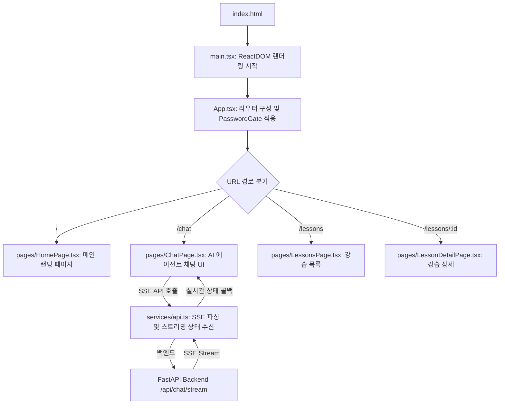

# Client Directory Guide

이 문서는 **Course Agent** 프론트엔드 서비스(`client/`)의 디렉토리 구조 및 파일별 구체적인 역할과 연결 관계를 설명합니다.

---

## 1. 프론트엔드 핵심 파일 실행 흐름

사용자가 브라우저를 통해 서비스를 방문하고 AI 채팅 및 강습 기능을 이용할 때의 전체 흐름입니다.

---

## 2. 파일별 상세 역할 정의

### 2.1 프론트엔드 진입점 및 라우팅
* **`index.html`**
  * **역할**: Single Page Application(SPA)의 뼈대가 되는 기본 HTML 파일로, Google Fonts(Inter, Outfit 등) 적용 및 `main.tsx` 진입점 스크립트를 로드합니다.
* **`main.tsx`**
  * **역할**: React의 `ReactDOM.createRoot`를 사용해 최상위 컨포넌트를 렌더링하고, 글로벌 스타일시트(`index.css`)를 불러옵니다.
* **`App.tsx`**
  * **역할**: React Router v6 기반으로 전체 서비스의 라우팅 설정(일반 페이지, 마이페이지, 어드민 페이지)을 매핑하고, 외부 노출 제한을 위해 `PasswordGate` 데코레이터를 최상위에 씌워 보호합니다.

### 2.2 공용 UI 컴포넌트 (`client/src/components/`)
* **`PasswordGate.tsx`**
  * **역할**: 환경변수로 주입된 게이트 비밀번호와 사용자가 입력한 비밀번호를 비교하여 일치하는 경우에만 화면 진입을 허용하는 보안 가드 컴포넌트입니다.
* **`ScrollToTop.tsx`**
  * **역할**: 페이지 라우팅 전환 시 윈도우 스크롤 위치를 최상단(`y=0`)으로 강제 초기화해주는 UI 헬퍼입니다.

### 2.3 주요 화면 컴포넌트 (`client/src/pages/`)
* **`HomePage.tsx`**
  * **역할**: 서비스의 랜딩 페이지입니다. 추천 스포츠 종목 요약, 주요 기능(AI 가이드, 강습 추천) 소개 배너 및 비주얼 디자인 요소가 포함됩니다.
* **`ChatPage.tsx`**
  * **역할**: **핵심 AI 스포츠 비서와 대화하는 채팅 뷰**입니다. 사용자의 질문을 백엔드 스트리밍 엔드포인트로 요청하고, 백엔드로부터 전송받은 실시간 에이전트 상태(Supervisor -> Lesson -> FAQ 등)를 시각적인 상태 로더로 연동하여 단계별 흐름을 사용자에게 연출합니다.
* **`LessonsPage.tsx` / `LessonDetailPage.tsx`**
  * **역할**: 플랫폼에 등록된 개별 스포츠 강습의 목록과 필터링(종목, 수준별), 상세 커리큘럼, 담당 강사 정보 및 수강 신청 폼을 렌더링합니다.
* **`CoursesPage.tsx` / `CourseDetailPage.tsx` / `CourseCreatePage.tsx`**
  * **역할**: 코스 생성, 수정, 정보 조회를 담당하는 보조 코스 관리 뷰 그룹입니다.
* **`admin/` 및 `my/` 하위 컴포넌트들**
  * **역할**: 
    * `admin/`: 강습 등록 승인, AI 피드백 자동 생성 및 전반적인 수강 현황 대시보드를 위한 관리자 기능 모듈입니다.
    * `my/`: 본인이 신청한 수강 목록 확인, 찜한 목록 및 최근 출석 상태를 보여주는 사용자 마이페이지 모듈입니다.

### 2.4 네트워크 및 API 연동 (`client/src/services/`)
* **`api.ts`**
  * **역할**: Axios 인스턴스를 정의하여 공통 헤더 및 API 기본 URL을 주입하고, **SSE 스트리밍 연동 로직**을 구현합니다.
  * **연결 관계**: `POST /api/chat/stream` 호출 시 반환되는 스트림 버퍼를 라인 단위로 디코딩하고, AI 에이전트 전이 이벤트(`status`)와 자연어 텍스트 조각(`token`)을 구별하여 각각 UI의 콜백 핸들러로 중개 공급합니다.

---

## 3. 백엔드 서비스와의 유기적 연결성

* **실시간 SSE 데이터 매핑**: 
  * `api.ts`가 가공한 데이터 구조는 `ChatPage.tsx`의 내부 상태인 `messages`와 `runningAgent`에 즉각 반영되어, 실시간 대화 피드 및 로딩 인터페이스를 동적으로 갱신합니다.
* **관리자 AI 자동 연동**:
  * 관리자가 강습을 생성할 때, `CourseCreatePage.tsx` 등에서 입력된 원본 정보를 바탕으로 백엔드 AI가 커리큘럼을 생성하는 과정을 REST API 비동기 액션으로 연합 호출합니다.
