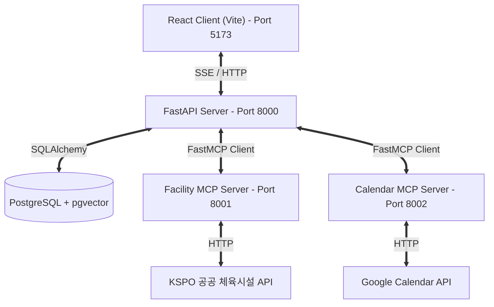
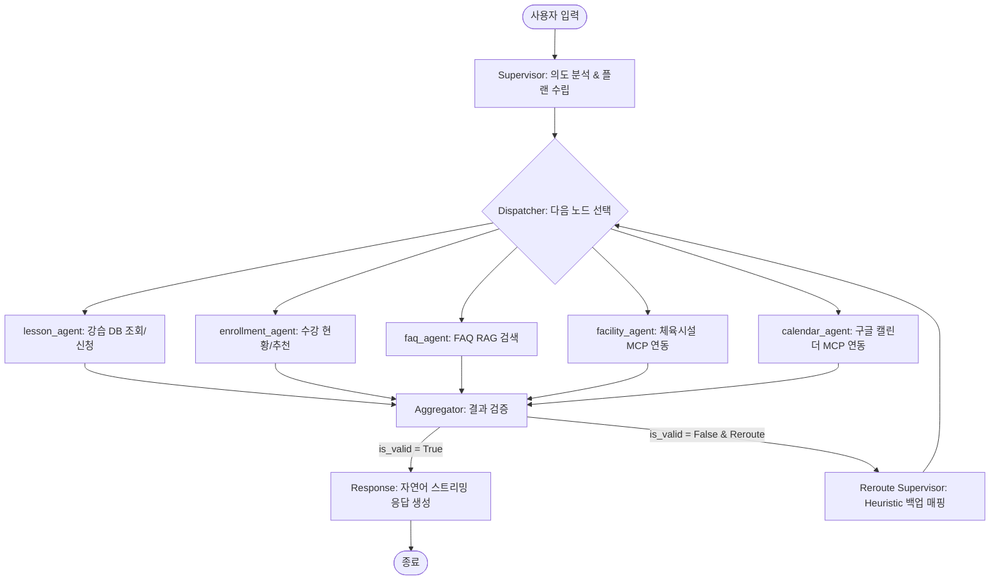
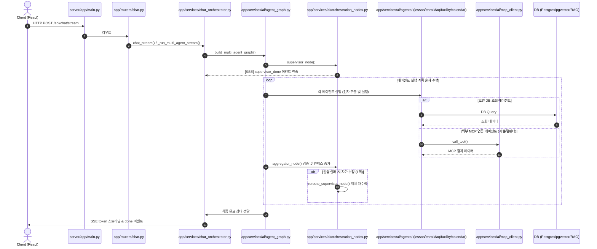
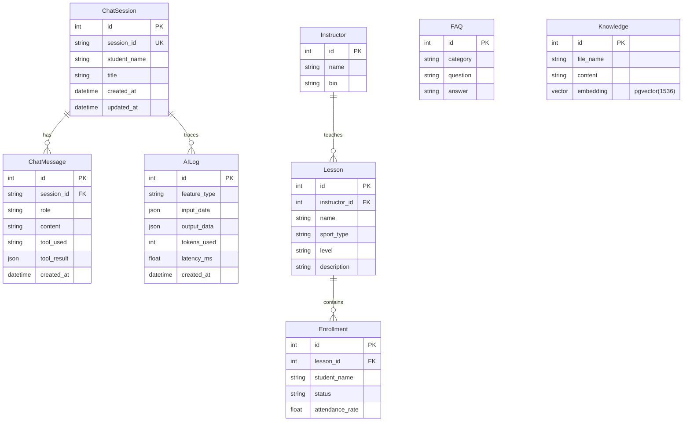

# Course Agent

LangGraph 기반 멀티에이전트 + MCP 클라이언트/서버를 갖춘 AI 스포츠 강습 플랫폼

## 라이브 데모

| 항목 | 링크 |
|---|---|
| **사용자 화면** | [course-agent.vercel.app](https://course-agent.vercel.app) |
| **관리자 대시보드** | [course-agent.vercel.app/admin/dashboard](https://course-agent.vercel.app/admin/dashboard) |
| **API 문서 (Swagger)** | [course-agent-production.up.railway.app/docs](https://course-agent-production.up.railway.app/docs) |

배포 환경: Vercel(프론트) + Railway(백엔드 + MCP 서버 + Postgres)

### 핵심 특징

- **LangGraph Supervisor 패턴 기반 멀티에이전트** — lesson / enrollment / faq / facility / calendar 5개 도메인 서브에이전트 분리, 복합 질문 multi-agent 순차 실행
- **Self-Correction 재라우팅** — 에이전트 결과 부실 시 다른 도메인으로 자동 재분배 (예: lesson 검색 실패 -> faq로 자동 폴백, calendar 실패 -> lesson으로 폴백)
- **MCP 클라이언트/서버 양방향 구현** — 공공 체육시설 API(KSPO)와 Google Calendar API를 MCP 도구로 노출하는 독립 서버 구축 및 Course Agent의 MCP 클라이언트 연동
- **SSE 토큰 스트리밍** — LangGraph 노드별 실시간 상태 + GPT 토큰 스트림
- **RAG (pgvector)** — 125개 지식 청크 임베딩 + 코사인 유사도 검색, ILIKE 폴백 지원
- **Langfuse 관측성** — 모든 에이전트 노드·LLM 호출 end-to-end trace
- **마이크로서비스 인프라** — docker-compose로 로컬 통합, Railway internal DNS로 프로덕션 서비스 간 통신

## 데모 시나리오

| 사용자 입력 | 동작 |
|---|---|
| `"수영 강습 알려줘"` | Supervisor -> `lesson` 단일 호출 -> DB 검색 결과 반환 |
| `"강습 목록 보여주고 환불 규정도 알려줘"` | Supervisor -> `multi_agent: [lesson, faq]` 순차 실행 -> 통합 응답 |
| `"서울에서 수영장 알려줘"` | Supervisor -> `facility` -> MCP 호출 -> KSPO 공공 API 결과 |
| `"내일 오전 10시에 테니스 강습 일정 구글 캘린더에 등록해줘"` | Supervisor -> `calendar` -> MCP 호출 -> 구글 캘린더 이벤트 등록 성공 |
| `"내일 스케줄 확인해줘"` | Supervisor -> `calendar` -> MCP 호출 -> 구글 캘린더 일정 조회 |
| `"파쿠르 강습 있어?"` | Supervisor -> `lesson` 실패 -> **재라우팅** -> `faq` -> 대안 안내 |
| `"강남에서 수영 배우고 싶은데 근처 수영장도 알려줘"` | Supervisor -> `multi_agent: [lesson, facility]` |

## 아키텍처

상세 설계 문서: [`ARCHITECTURE.md`](./ARCHITECTURE.md)

### 시스템 구성



### 멀티에이전트 흐름



### 파일별 실행 흐름



## 기술 스택

### Backend (`server/`)

| 분류 | 기술 |
|---|---|
| 언어/프레임워크 | Python 3.11+, FastAPI, SQLAlchemy(async) |
| 에이전트 | LangGraph (Supervisor 패턴) |
| LLM | OpenAI GPT-4o-mini |
| RAG | pgvector(HNSW), text-embedding-3-small |
| 관측 | Langfuse |
| 스트리밍 | sse-starlette |
| MCP | fastmcp.Client |

### Frontend (`client/`)

React 18, TypeScript, Vite, TailwindCSS, React Router v6, Axios

### MCP Servers (`mcp_servers/`)

* **`facility_server/`**: Python 3.11+, FastMCP 3.x, httpx, cachetools (공공 체육시설 중개)
* **`calendar_server/`**: Python 3.11+, FastMCP 3.x, google-api-python-client, google-auth, python-dotenv (구글 캘린더 중개)

### 인프라

PostgreSQL + pgvector(pg17), docker-compose, Railway, Vercel

## 디렉토리 구조

```text
course-agent/
├── server/                              # Course Agent 백엔드 (FastAPI)
│   ├── app/
│   │   ├── models/                      # SQLAlchemy 모델 (lesson, enrollment, chat, knowledge ...)
│   │   ├── routers/                     # API 라우터 (admin/, my/, lessons, chat)
│   │   ├── services/
│   │   │   ├── chat_orchestrator.py     # 비스트리밍/스트리밍 채팅 오케스트레이션
│   │   │   ├── recommendation_service.py
│   │   │   ├── feedback_service.py
│   │   │   ├── dashboard_service.py
│   │   │   └── ai/
│   │   │       ├── agent_state.py       # AgentState (TypedDict)
│   │   │       ├── agent_graph.py       # build_multi_agent_graph + 조건부 분기
│   │   │       ├── agent_nodes.py       # response_node + 공용 헬퍼
│   │   │       ├── orchestration_nodes.py  # Supervisor + Aggregator + reroute_supervisor
│   │   │       ├── mcp_client.py        # facility / calendar MCP 호출 클라이언트
│   │   │       ├── tool_executor.py     # lesson/enrollment/faq 도구 실행
│   │   │       ├── embedding_service.py # RAG 임베딩 생성 + pgvector 검색
│   │   │       ├── langfuse_client.py   # Langfuse 싱글톤
│   │   │       ├── llm_client.py        # OpenAI 클라이언트
│   │   │       └── agents/
│   │   │           ├── base.py          # make_subagent 팩토리
│   │   │           ├── lesson_agent.py
│   │   │           ├── enrollment_agent.py
│   │   │           ├── faq_agent.py
│   │   │           ├── facility_agent.py  # MCP 호출 서브에이전트
│   │   │           └── calendar_agent.py  # 구글 캘린더 연동 서브에이전트
│   │   └── main.py
│   ├── knowledge_base/                  # RAG 지식 (md 19개, 청크 125개)
│   ├── scripts/                         # load_knowledge.py, seed_data.py
│   ├── alembic/                         # DB 마이그레이션
│   ├── Dockerfile
│   └── requirements.txt
│
├── mcp_servers/
│   ├── facility_server/                 # 독립 MCP 서버 (KSPO 공공 API 래핑)
│   │   ├── app/
│   │   │   ├── main.py                  # FastMCP 진입점
│   │   │   └── ...
│   │   └── README.md
│   └── calendar_server/                 # 독립 MCP 서버 (Google Calendar API 래핑)
│       ├── app/
│       │   ├── main.py                  # FastMCP 진입점
│       │   ├── config.py                # pydantic-settings
│       │   └── __init__.py
│       ├── Dockerfile
│       ├── requirements.txt
│       ├── .env.example
│       └── README.md
│
├── client/                              # React 프론트엔드
│   └── ...
│
└── docker-compose.yml                   # 복수 컨테이너 통합 기동
```

## AI 기능 상세

### 1. 멀티에이전트 채팅

| 구성 요소 | 책임 |
|---|---|
| Supervisor | 사용자 의도를 분석해 에이전트 계획 수립 (direct/single/multi) |
| lesson_agent | 강습 검색·상세 조회 (DB) |
| enrollment_agent | 수강 현황·맞춤 추천 (DB) |
| faq_agent | FAQ RAG 검색 (pgvector + ILIKE 폴백) |
| facility_agent | 공공 체육시설 검색 (MCP -> KSPO API) |
| calendar_agent | 구글 캘린더 일정 추가/확인 (MCP -> Google Calendar API) |
| Aggregator | 에이전트 결과 통합·검증 (`is_valid`) |
| Reroute Supervisor | 휴리스틱 매핑(lesson->faq, facility->lesson, calendar->lesson 등)으로 재라우팅 |
| Response (stream) | OpenAI `stream=True`로 토큰 단위 SSE 출력 |

### 2. AI 콘텐츠 자동 생성

강습 등록 시 GPT-4o-mini로 소개문구·커리큘럼 자동 생성. 항목별 개별 재생성 가능.

### 3. 맞춤 추천

추천 이유는 GPT-4o-mini가 개인화하여 생성.

## 데이터 모델



체육시설 및 구글 캘린더 데이터는 외부 API 호출 방식이라 로컬 DB에 테이블 없음.

## 배포

### Railway (백엔드 및 MCP 서버)

| 서비스 | 역할 | 노출 |
|---|---|---|
| `pgvector` | Postgres + pgvector 확장 | internal only |
| `course-agent` | FastAPI 본체 | public |
| `facility-mcp` | 시설 검색 MCP 서버 | internal only (`facility-mcp.railway.internal:8001`) |
| `calendar-mcp` | 캘린더 MCP 서버 | internal only (`calendar-mcp.railway.internal:8002`) |

GitHub `main` 브랜치 push 시 Railway가 Dockerfile 기반으로 자동 빌드·재배포.
