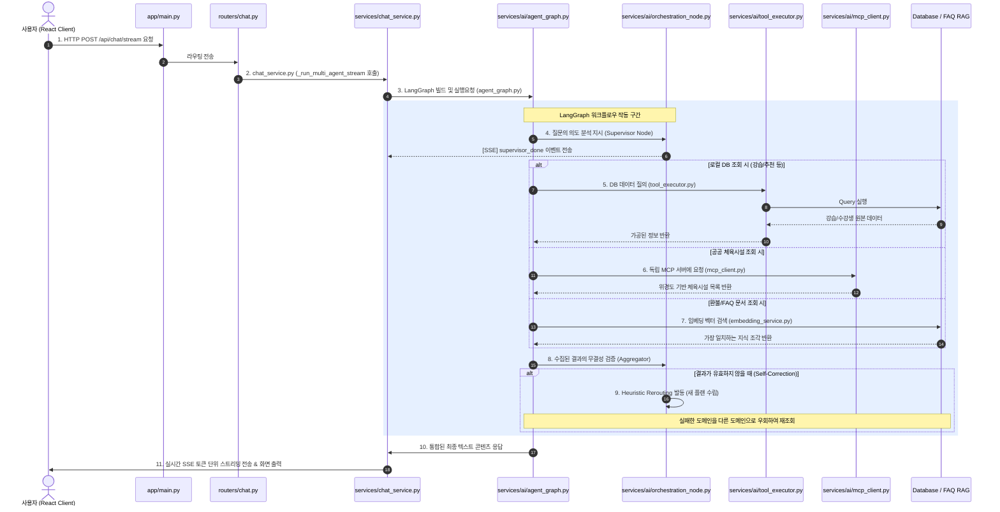

# Server Directory Guide

이 문서는 **Course Agent** 백엔드 서비스(`server/`)의 디렉토리 구조 및 파일별 구체적인 역할과 연결 관계를 설명합니다.

---

## 1. 파일 간 연결 및 실행 흐름

사용자가 프론트엔드에서 채팅창을 통해 스포츠에 대한 질문을 보내왔을 때, `server` 내부의 파일들이 상호작용하는 시퀀스입니다.

---

## 2. 파일별 상세 역할 정의

### 2.1 진입점 및 시스템 설정
* **`main.py`**
  * **역할**: FastAPI 어플리케이션 인스턴스를 생성하고 미들웨어(CORS), 전역 예외 처리기, API 라우터들을 연동하는 백엔드 서버의 **메인 시작점**입니다.
  * **연결 관계**: 외부의 모든 HTTP 요청을 받아서 `server/app/routers/` 하위 모듈들로 이관합니다.
* **`config.py`**
  * **역할**: `.env` 파일과 시스템 환경 변수를 Pydantic Settings를 기반으로 읽어와서 파싱 및 유효성 검증을 마친 후 전역 설정 객체로 관리합니다.
  * **연결 관계**: 데이터베이스 설정, OpenAI API 키 설정, 모니터링 환경 등을 제공하여 프로젝트 전반에서 참조됩니다.
* **`database.py`**
  * **역할**: SQLAlchemy 비동기 엔진을 초기화하고 세션 컨텍스트 팩토리(`async_sessionmaker`)를 관리합니다.
  * **연결 관계**: API 핸들러에서 DB에 액세스하기 위해 사용하는 세션 주입용 의존성 함수(`get_db`)를 제공합니다.

### 2.2 비즈니스 로직 계층 (Services)
* **`chat_service.py`**
  * **역할**: 프론트엔드와 주고받는 채팅 내역을 영속성 데이터베이스에 저장하고, 실시간 LangGraph 호출을 통해 **멀티에이전트 실행 상태 분석 및 SSE 전송 규격 포맷팅**을 총괄 조율합니다.
  * **연결 관계**: `agent_graph.py`를 기동하고 이벤트를 비동기적으로 클라이언트에 전송합니다.
* **`lesson_service.py`**
  * **역할**: 새로운 스포츠 강습 등록, 수정, 필터 기반 조회 등 강습 도메인의 비즈니스 로직을 구현합니다.
  * **연결 관계**: 새로운 강습 정보가 추가되었을 때 AI 기반으로 소개글 및 커리큘럼 초안을 자동 빌드하기 위해 `content_generator.py`를 실행합니다.
* **`recommendation_service.py`**
  * **역할**: 회원의 참여 이력, 미완료 강습률, 찜 정보 등을 분석하여 맞춤형 다음 단계 스포츠 강습 추천 풀을 추출하고 정렬합니다.
  * **연결 관계**: 맞춤형 AI 추천 에이전트(`enrollment_agent.py`)의 도구 연산 내부에서 비즈니스 로직을 보조합니다.

### 2.3 AI 워크플로우 인프라 계층 (`server/app/services/ai/`)
* **`agent_state.py`**
  * **역할**: LangGraph 내의 상태 변수 스키마(`AgentState`)를 관리합니다. 대화 맥락, 수립된 탐색 계획, 서브 에이전트 결과들이 한곳에 집계되는 칠판 역할을 합니다.
  * **연결 관계**: LangGraph 상의 모든 실행 노드와 제어 스크립트가 해당 상태 사전을 입력받고 수정합니다.
* **`agent_graph.py`**
  * **역할**: 에이전트들과 총괄 관리자(Supervisor)를 노드로 구성하고, 각 노드가 실행을 마친 뒤 어느 노드로 흘러갈지 제어 조건(Edge)을 설정하여 LangGraph 인스턴스를 빌드합니다.
  * **연결 관계**: `chat_service.py`가 인스턴스를 받아서 연산을 구동합니다.
* **`orchestration_node.py`**
  * **역할**: 
    1. **Supervisor**: 질문의 유형을 분별하여 수강/강습/체육시설/FAQ 중 필요한 곳에 임무를 라우팅합니다.
    2. **Aggregator**: 수집 결과를 검증하고, 실패한 경우 자가 수정 우회 라우팅(Heuristic Rerouting)을 지정합니다.
  * **연결 관계**: 에이전트 연산 상태를 확인하고 다른 노드로의 분기를 제어합니다.
* **`agent_nodes.py`**
  * **역할**: 각 서브 에이전트들이 도메인 연산을 한 성과물을 받아 상태 사전에 기록하고, 최종 에이전트들의 합의 결과를 조합하여 하나의 자연어로 답변하는 노드를 정의합니다.
  * **연결 관계**: `agent_graph.py`에 노드로 조립됩니다.
* **`tool_executor.py`**
  * **역할**: AI 에이전트가 로컬 데이터베이스를 조회할 수 있게 돕는 다양한 DB 쿼리 전용 도구(Tool)들을 래핑하여 모아둔 파일입니다.
  * **연결 관계**: `lesson_agent.py`와 `enrollment_agent.py`가 실행 중에 이를 도구 함수로 활용합니다.
* **`mcp_client.py`**
  * **역할**: `FastMCP` 클라이언트를 구현하여 다른 독립 도커 컨테이너 또는 프로세스로 배포된 MCP 서버에서 체육시설 검색 API 도구를 원격으로 요청해 결과를 가공합니다.
  * **연결 관계**: `facility_agent.py`가 공공 위치 정보를 찾기 위해 사용합니다.
* **`embedding_service.py`**
  * **역할**: OpenAI 임베딩 API 연동 및 PostgreSQL의 `pgvector` 코사인 유사도 연산 쿼리를 직접 수행하여 RAG(지식 검색)의 원천 조회를 대행합니다.
  * **연결 관계**: `faq_agent.py`의 도구로 실행됩니다.

### 2.4 개별 전문 서브 에이전트 (`server/app/services/ai/agents/`)
* **`base.py`**
  * **역할**: 시스템 프롬프트(System Prompt) 페르소나 및 바인딩할 도구 리스트를 조합해 재사용 가능한 에이전트를 공장식으로 빌드해주는 `make_subagent` 팩토리를 관리합니다.
  * **연결 관계**: 다른 개별 서브 에이전트들이 공통 모델로 참조합니다.
* **`lesson_agent.py`**
  * **역할**: "강습 검색 및 매칭"에 전문화된 에이전트 인스턴스이며, 로컬 DB 강습 목록 검색 기능 도구를 품고 있습니다.
* **`enrollment_agent.py`**
  * **역할**: "수강 내역 조회 및 맞춤 스포츠 추천"에 전문화된 에이전트 인스턴스입니다.
* **`faq_agent.py`**
  * **역할**: "규정 및 정책 안내"에 특화된 FAQ 에이전트이며, `pgvector` RAG 지식 검색 기능 도구를 품고 있습니다.
* **`facility_agent.py`**
  * **역할**: "전국 공공 체육시설 지도 기반 정보 검색"에 특화된 에이전트이며, MCP 클라이언트 원격 연동 도구를 사용합니다.
