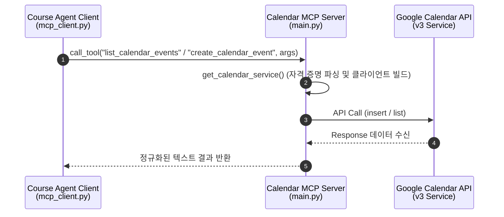

# Calendar MCP Server

Google Calendar API를 MCP(Model Context Protocol) 도구로 래핑한 **독립 실행 서버**.

Course Agent의 `calendar_agent`가 HTTP MCP 클라이언트로 이 서버를 호출해 구글 캘린더 일정 조회 및 등록을 수행한다. Claude Desktop 등 다른 MCP 클라이언트에도 그대로 연결 가능.

## 기능

| 도구 | 설명 |
|---|---|
| `ping` | 헬스 체크 |
| `create_calendar_event` | 구글 캘린더에 새로운 일정(제목, 시작 시간, 종료 시간, 상세 설명)을 생성 |
| `list_calendar_events` | 지정한 시작/종료 범위 및 개수에 맞춰 등록된 일정 목록을 조회 |

## 아키텍처

## 기술 스택

- Python 3.11+
- [FastMCP 3.x](https://gofastmcp.com/) — MCP 프로토콜 서버
- google-api-python-client — Google API 클라이언트 라이브러리
- google-auth — 서비스 계정 인증
- pydantic-settings

## 인증 및 연동 설정

본 서버는 구글 서비스 계정(Service Account)을 활용하여 구글 캘린더 API를 대리 호출합니다. 정상적인 동기화를 위해 다음 설정이 선행되어야 합니다.

1. **서비스 계정 키 발급**: Google Cloud Console에서 서비스 계정을 생성하고 비공개 키 JSON 파일을 다운로드합니다. 이 파일의 원본 텍스트를 `GOOGLE_SERVICE_ACCOUNT_INFO` 환경변수로 주입합니다.
2. **캘린더 권한 공유**: 연동할 개인 구글 캘린더 ID(예: 본인 Gmail 계정)의 설정 메뉴로 이동하여, 위 서비스 계정 이메일 주소에 대해 **"변경 및 공유 관리"** 권한을 부여하고 초대를 수락합니다.

## 환경변수

| Key | Default | 설명 |
|---|---|---|
| `GOOGLE_SERVICE_ACCOUNT_INFO` | (필수) | 서비스 계정 비공개 키 JSON 데이터 문자열 |
| `GOOGLE_CALENDAR_ID` | (필수) | 대상 구글 캘린더 ID (개인 이메일 주소) |
| `MCP_HOST` | `127.0.0.1` | 바인딩 주소. Docker 실행 시 `0.0.0.0` |
| `MCP_PORT` | `8002` | 포트 |

## 배포

GitHub `main` 브랜치 push 시 Railway가 Dockerfile로 자동 빌드·재배포.

| 항목 | 값 |
|---|---|
| 서비스명 | `calendar-mcp` |
| 접근 방식 | internal DNS only (외부 비노출) |
| Internal DNS | `calendar-mcp.railway.internal:8002` |
| 호출 환경변수 | `CALENDAR_MCP_URL=http://calendar-mcp.railway.internal:8002/mcp` |

`course-agent` 서비스가 위 환경변수로 호출.
