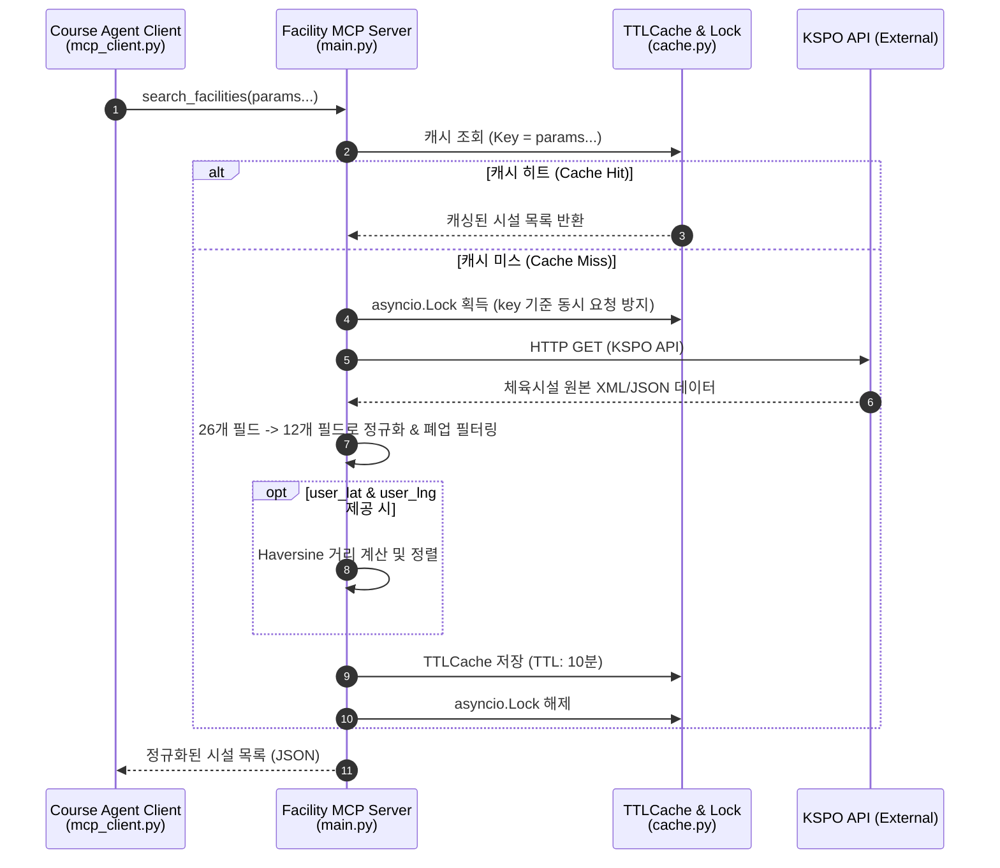

# Facility MCP Server

공공데이터포털의 [전국 체육시설 API(KSPO)](https://www.data.go.kr/data/15052633/openapi.do)를 MCP(Model Context Protocol) 도구로 래핑한 **독립 실행 서버**.

Course Agent의 `facility_agent`가 HTTP MCP 클라이언트로 이 서버를 호출해 지역·종목 기반 체육시설 검색을 수행한다. Claude Desktop 등 다른 MCP 클라이언트에도 그대로 연결 가능.

## 기능

| 도구 | 설명 |
|---|---|
| `ping` | 헬스 체크 |
| `search_facilities` | 시도·시군구·시설유형·업종·시설명으로 체육시설 검색. `user_lat`/`user_lng` 주어지면 haversine 거리순 정렬 |

응답 시:
- 폐업 시설은 자동 제외 (`include_closed=False` 기본값)
- 위경도는 `float`로 변환 (KSPO 원본은 문자열)
- 26개 원본 필드 중 12개로 정규화하여 반환

## 아키텍처

## 기술 스택

- Python 3.11+
- [FastMCP 3.x](https://gofastmcp.com/) — MCP 프로토콜 서버
- httpx (async HTTP)
- cachetools — TTL 메모리 캐시
- pydantic-settings

## 캐시 전략

- **In-memory TTL** (`cachetools.TTLCache`)
  - 기본 TTL 10분, 최대 256 entries
  - 동일 쿼리 파라미터에 대해 외부 API 중복 호출 방지
- **per-key `asyncio.Lock`**으로 동시 요청 race condition 방지
- 캐시 키에서 `serviceKey`는 제외 (키 변경 시 캐시 통째로 무효화 회피)

KSPO API의 시도·시군구·시설유형 필터를 그대로 사용하므로 SQLite 시드 같은 사전 동기화 없이 실시간 호출만으로 충분. 일일 트래픽 쿼터 10,000회 안에서 운용.

## 환경변수

| Key | Default | 설명 |
|---|---|---|
| `KSPO_API_KEY` | (필수) | 공공데이터포털 인증키 |
| `KSPO_BASE_URL` | `https://apis.data.go.kr/B551014/SRVC_API_SFMS_FACI` | API 엔드포인트 |
| `KSPO_TIMEOUT_SECONDS` | `10.0` | HTTP 타임아웃 |
| `CACHE_TTL_SECONDS` | `600` | 캐시 유효 시간 (10분) |
| `CACHE_MAXSIZE` | `256` | 캐시 최대 항목 수 |
| `MCP_HOST` | `127.0.0.1` | 바인딩 주소. Docker는 `0.0.0.0` |
| `MCP_PORT` | `8001` | 포트 |

## 배포

GitHub `main` 브랜치 push 시 Railway가 Dockerfile로 자동 빌드·재배포.

| 항목 | 값 |
|---|---|
| 서비스명 | `facility-mcp` |
| 접근 방식 | internal DNS only (외부 비노출) |
| Internal DNS | `facility-mcp.railway.internal:8001` |
| 호출 환경변수 | `FACILITY_MCP_URL=http://facility-mcp.railway.internal:8001/mcp` |

`course-agent` 서비스가 위 환경변수로 호출.
